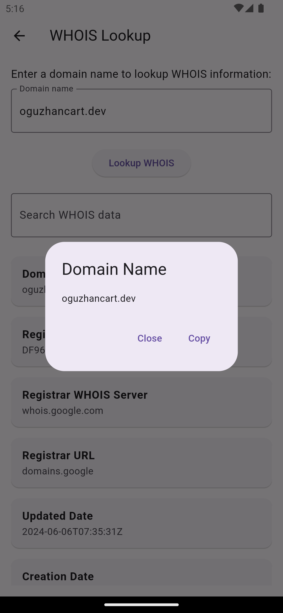

# WHOIS Lookup App


## Overview

The WHOIS Lookup App is a simple Flutter application that allows users to perform WHOIS lookups for any domain. It provides detailed information about domain registrations, such as the registrar, registration date, and contact information. Users can also save their search results for future reference.

## Features

* Quick and easy WHOIS lookups
* Save your search results
* View previously saved domains
* Simple and intuitive interface

## Screenshots

1. **Home Screen** 
   


2. **WHOIS Lookup Screen** 
   


3. **WHOIS Results Screen** 
   


4. **Saved Domains Screen** 
   


5. **WHOIS Detail Modal** 
   



## Installation

1. Clone the repository:
```bash
 git clone https://github.com/oguzhan18/whois_app
```

2. Navigate to the project directory:
```bash
cd whois_app
```
3. Install dependencies:
```bash
flutter pub get
```
4. Run the app:
```bash
flutter run
```


## For Support
For support, send an email to oguzhancart1@gmail.com or you are invited to our telegram channel https://t.me/vsform_tr  
 
## Contact Me
<p align="center">
<a href="https://codepen.io/oguzhan1881" target="blank"></a>
<a href="https://dev.to/oguzhan18" target="blank"></a>
<a href="https://twitter.com/oguzhancart" target="blank"></a>
<a href="https://linkedin.com/in/o%c4%9fuzhan-%c3%a7art-b73405199/" target="blank"></a>
<a href="https://codesandbox.com/oguzhan18" target="blank"></a>
<a href="https://instagram.com/oguzhan_cart" target="blank"></a>
<a href="https://dribbble.com/cart188" target="blank"></a>
<a href="https://hashnode.com/@oguzhancart" target="blank"></a>
<a href="https://www.leetcode.com/oguzhan18/" target="blank"></a>
</p>
